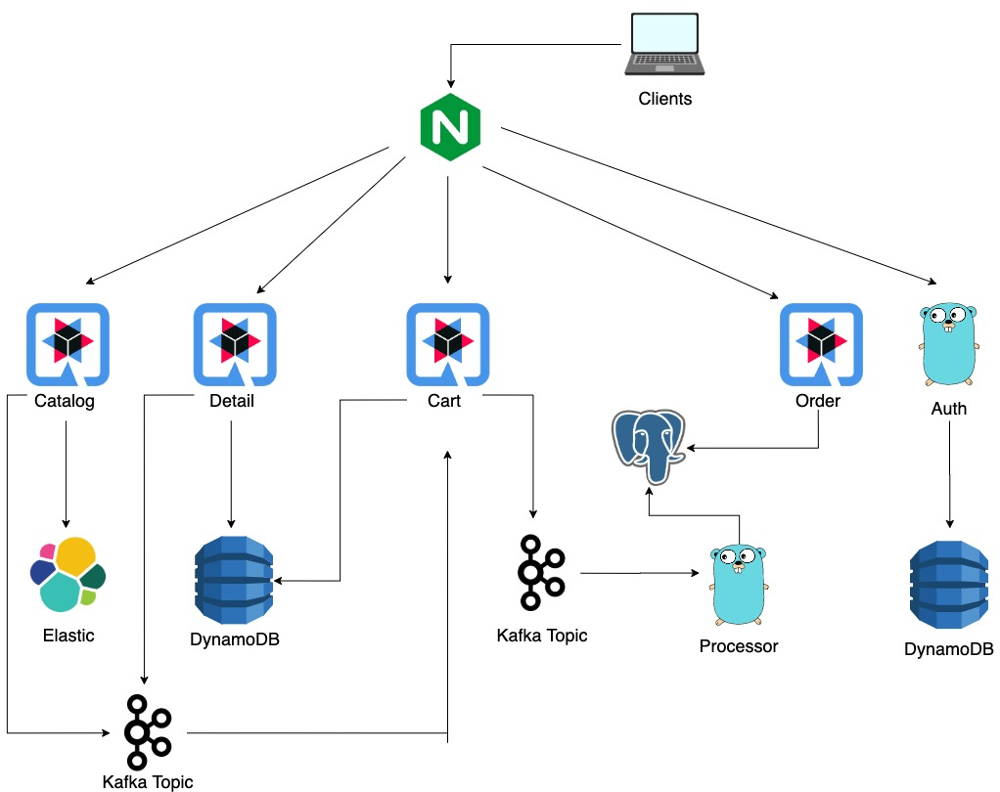

# ecommerce
An simplified e-commerce using top technologies to support high availability.

# Technologies

made with microservices in Quarkus (Java) and Golang using:

* ElasticSearch
* DynamoDB
* PostgresSQL
* Apache Kafka

* Nginx (local APIGateway)

# Architecture of ecommerce:

